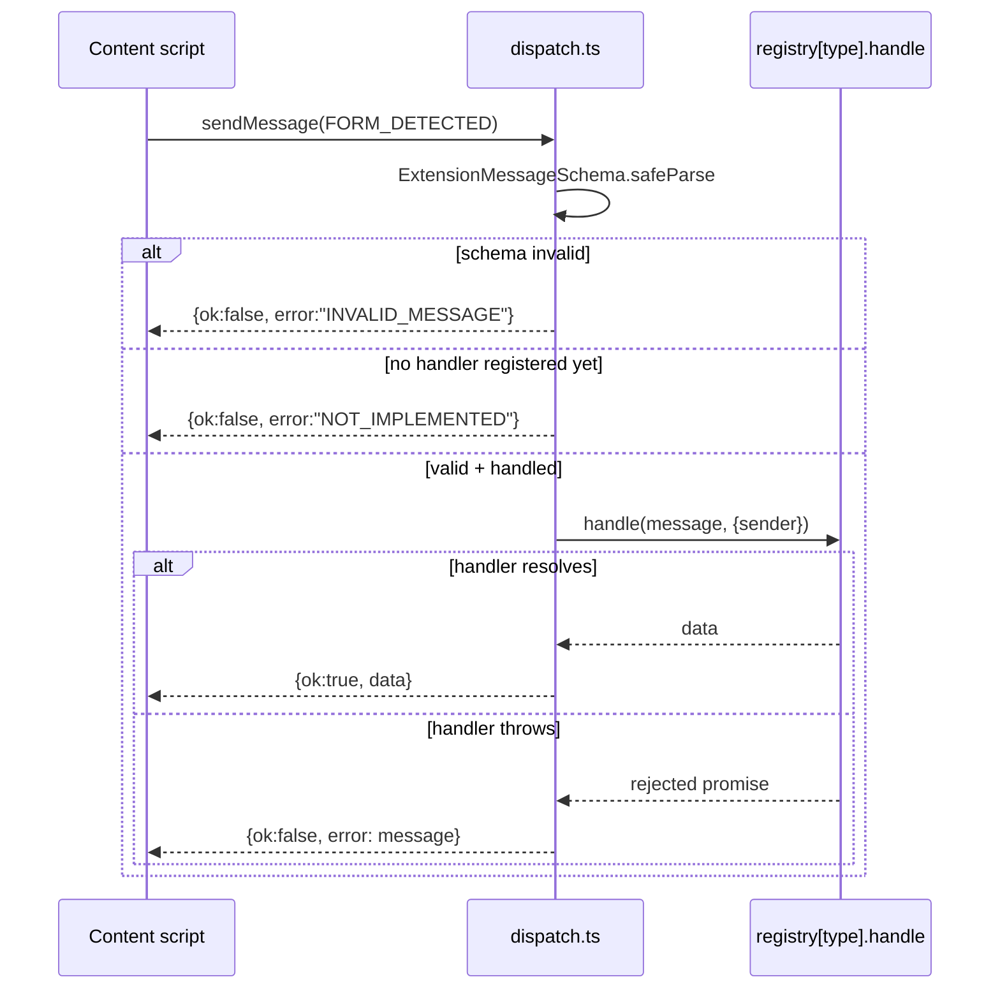
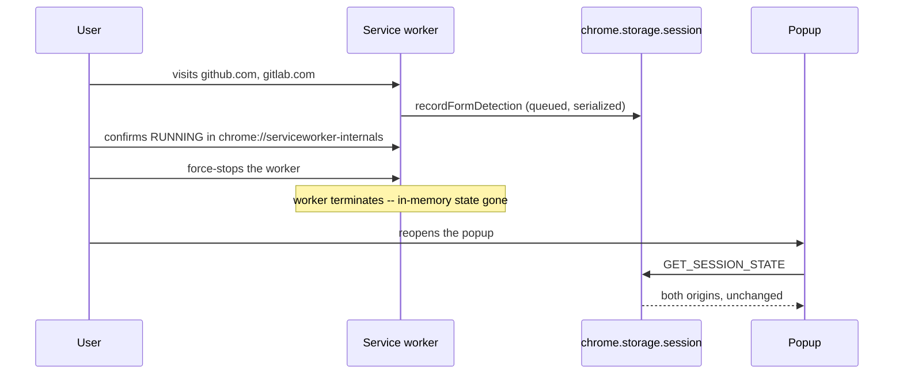

# The Exchange — Phase 1 Recap

**Interactive version:** https://claude.ai/code/artifact/e293d1ae-d62d-44fa-bcc9-39b52176c9fa
**Commit range covered:** `d09aaf3`…`5d8759f`

Before Identity Firewall could isolate anything, it needed a switchboard: a way for a page to report what it sees, a background operator to route that report somewhere useful, and a line log that survives the operator stepping away. Phase 1 builds the exchange the rest of the project runs its calls through.

## The line, station by station

Seven commits, each a real dependency of the next — the plan first, then the wiring, message by message, until a human could sit at a real page and watch it work.

0. **The wiring diagram** (`d09aaf3`) — what Phase 0's research meant for an actual WXT project, before any code.
1. **M1 — The cabinet** (`9bd2d75`) — the extension scaffold itself.
2. **M2 — The ticket format** (`9e89251`) — the shared message contract.
3. **M3 — The operator** (`6ac11a8`, `4919b23`) — the router that guarantees every call gets answered exactly once.
4. **M4 — The listening post** (`dc470f2`) — the content script that notices a form and phones it in.
5. **M5 — The display board** (`4a0dbc7`) — the popup that shows what's been heard this session.
6. **M6 — The dry run** (`1d10b15`) — a real browser, not a mock, proving the line works.
7. **M7 — Pulling the plug** (`5d8759f`) — killing the operator mid-shift, on purpose, to prove the log survives.

## How a call actually gets answered

Every message the extension will ever send — this phase's or any later one's — passes through one operator, built with one specific failure already fixed.

Four paths in, four replies out — never zero, never two. `background/router/dispatch.ts`'s own header comment names the bug this closes: a real, shipped Attestto defect where an unhandled rejection left a caller waiting on a reply that would never arrive, indistinguishable from a person simply walking away.

## M0 — The wiring diagram, before any wire (`d09aaf3`)

A plan document, not code — but the one every milestone below cites. Two things had to be checked against reality before scaffolding could start honestly: the exact current WXT (0.21.4) and Tailwind (4.3.3) versions, not whatever Phase 0's research sketch had assumed weeks earlier, and how the message-router / session-state / content-script shapes from that research would map onto seven concrete milestones with a real directory tree and an acceptance checklist.

One conflict got resolved on the page, not left for later: the research had briefly entertained a MAIN-world content script. ADR-011 already rules that out — it forbids ever intercepting `navigator.credentials`, in this phase or any other — so the plan states plainly that no MAIN-world script is ever needed.

| Path | Purpose |
|---|---|
| `docs/plans/phase-1-extension-foundation.md` | Seven milestones, directory tree, acceptance checklist |
| `docs/research/phase-1-tooling-scaffold.md` | Verified current WXT/Tailwind tooling facts |
| `docs/research/phase-1-runtime-architecture.md` | Message-router and content-script design |

## M1 — The cabinet (`9bd2d75`)

Everything else in this project lives inside what this commit scaffolds. `wxt init` with the Vue template, pinned to `wxt@0.21.4`. Tailwind v4 wired in through `@tailwindcss/vite` (the v4 way, not a PostCSS config file), Pinia added for the stores every later phase leans on. The manifest declares exactly one permission — `storage` — no `host_permissions` at all, the literal starting position `docs/security-model.md`'s minimal-permissions stance calls for.

**Verified:** both production targets (`chrome-mv3`, `firefox-mv2`) build clean, `vue-tsc` type-checks, and the dev server's own auto-added dev-only permissions (`tabs`, `scripting`) were confirmed genuinely absent from the shipped manifest.

**Left on the table, on purpose:** Firefox's build surfaced two new manifest warnings (`data_collection_permissions`, `browser_specific_settings.gecko.id`) — parked as a Phase 8 (Open Source Release) item rather than fixed blind.

## M2 — The ticket format (`9e89251`)

Every message that will ever cross a boundary in this extension is validated against one union, defined once, here. `shared/messages.ts` ships the Phase 1 message set as a Zod discriminated union — `FORM_DETECTED`, `GET_SESSION_STATE`, `GET_ORIGIN_STATE` — plus the `MessageResponse` reply envelope every handler in every future phase still returns today. `shared/origin.ts` ships the one and only `normalizeOrigin()`, a branded `CanonicalOrigin` string so a raw, un-normalized URL can never silently pass as a storage key.

> **Why one function, emphatically:** Attestto's own codebase had five independent copies of equivalent origin-normalization logic before a mid-project consolidation. This project starts at one.

Vitest wired up via `WxtVitest()`. 13 tests: schema acceptance/rejection, plus origin normalization (default-port stripping, lowercasing, a non-default port kept distinct).

| Path | Purpose |
|---|---|
| `shared/messages.ts` | The Zod discriminated union + `MessageResponse` envelope |
| `shared/origin.ts` | The one `normalizeOrigin()`, `CanonicalOrigin` branded type |

## M3 — The operator (`6ac11a8`, `4919b23`)

The router in the sequence diagram above, plus the first storage module and the bugs a real review found in it. The capability-scoped router (`registry.ts` + `dispatch.ts`) and the `chrome.storage.session`-backed session module arrive together, alongside stub directories for `vault/`, `identity/`, `firewall/` — empty on purpose, so their shape is stable before Phase 2 and 3 need to fill them.

> **Found while building, not before:** WXT exposes a `browser` global from `wxt/browser`, not the bare `chrome` the original research sketch assumed. Imported explicitly rather than trusted as an ambient auto-import, for auditability — and the plan doc was corrected to match rather than left quietly wrong.

Biome (lint + format) and Husky (pre-commit `pnpm check`) both land here too — ahead of this milestone's original scope, adopted once the project had enough surface area to actually need them.

A follow-up commit the same day fixed three real bugs a code review found:

| Bug | Fix |
|---|---|
| Shared `EMPTY_STATE` singleton, mutated in place | Permanently corrupted the "empty" default — now a fresh object every read |
| Non-atomic read-modify-write | Concurrent writes could clobber each other — serialized through an in-memory queue |
| `handleGetOriginState` skipped normalization | A non-canonical origin would miss its own stored record |

| Path | Purpose |
|---|---|
| `background/router/registry.ts` | Capability → handler map |
| `background/router/dispatch.ts` | Exactly-once-reply guarantee |
| `background/session/state.ts` | Session-only per-origin form record, serialized writes |
| `background/session/handler.ts` | `GET_SESSION_STATE` / `GET_ORIGIN_STATE` |

## M4 — The listening post (`dc470f2`)

The one piece of this extension that ever touches a real page's DOM. `extractForms()`/`buildFormDetectedMessage()` live in `content/formDetection.ts` — pure functions, tested against jsdom fixtures, never inline in the entrypoint — mirroring M3's own background/ split. `entrypoints/content.ts` becomes a thin composition root that just calls them.

jsdom lands as a dependency here, opted into per-file (`// @vitest-environment jsdom`) rather than globally, so the rest of the suite keeps Vitest's faster Node default. 8 new tests, 33 total.

Five findings from a code-review pass, fixed before commit — two worth naming: the content script's `.catch()` only caught transport failures, so a real handler failure inside `recordFormDetection` was being silently dropped (now reads the resolved response and logs the failure); and tag-name matching was uppercase-only, silently under-reporting fields on XHTML documents (reverted to `instanceof` checks).

| Path | Purpose |
|---|---|
| `content/formDetection.ts` | Pure DOM extraction: which forms, which raw field attributes |
| `entrypoints/content.ts` | Composition root: extract, then `sendMessage` |

## M5 — The display board (`4a0dbc7`)

The first thing a person actually sees. `stores/session.store.ts` (Pinia) replaces the M1 placeholder popup with a real "sites detected this session" view, reading M3's `GET_SESSION_STATE`. The store lives at the top level — a sibling of `entrypoints/`, not nested inside it — the same placement M4's `content/` module had already established, resolving a disagreement between the plan doc and an older research sketch that had assumed nesting.

The store's own logic is unit-tested directly (Pinia's `setActivePinia` pattern, `fakeBrowser` mocking — 4 new tests, 37 total); the `.vue` template itself waits for M6's real browser and M7's human eyes, since the test pipeline doesn't compile Vue SFCs.

| Path | Purpose |
|---|---|
| `stores/session.store.ts` | `useSessionStore` — fetch-on-mount, no direct storage access |
| `entrypoints/popup/App.vue` | Real "sites detected" list, replacing the M1 placeholder |

## M6 — The dry run (`1d10b15`)

37 tests had mocked `browser.*` so far. This one drives the real, built extension in a real browser for the first time. Playwright's `channel: 'chromium'` and its `test.extend` fixture pattern were checked directly against Playwright's current documentation before writing anything. `tests/e2e/fixtures/server.ts` is a deliberately dependency-free static HTTP server using only Node's built-in `http`/`fs`; two distinct origins are two server instances on two OS-assigned ports, since `shared/origin.ts` already treats different ports as different origins.

The test launches `.output/chrome-mv3`, visits origin one, opens the popup, asserts, visits origin two, reopens the popup, and asserts both origins have accumulated — not just the most recent.

| Path | Purpose |
|---|---|
| `tests/e2e/fixtures/server.ts` | Two-origin static HTTP fixture server |
| `tests/e2e/formDetection.test.ts` | First real-browser end-to-end test |

## M7 — Pulling the plug (`5d8759f`)

The one property automated tests can't prove on their own: does the log survive when the operator disappears mid-shift? Run together with the user, in real Chrome, against the production build loaded unpacked. No manifest errors, exactly the `storage` permission. No console errors on a real page with a form. Two real sites — github.com, gitlab.com — both accumulated live in the popup.

**The centerpiece:** the real service worker, confirmed `RUNNING` beforehand, force-stopped via `chrome://serviceworker-internals/`. The popup still showed both previously-detected origins afterward — concrete, hands-on proof that session state survives a genuine MV3 worker restart, not merely in-memory state that happened to still be there.

Two things worth being honest about, not quietly dropped: the first attempt at a "no form" negative check used google.com — a bad example, not a bug, since Google's homepage has a form (the search box). And a full extension reload (a different event from a worker restart) does clear `storage.session` — expected, by design. Firefox's build was verified since M1; a real Firefox profile was not — documented as a gap, not claimed as tested.

## Terms worth knowing

- **MV3 service worker** — The extension's background process. Manifest V3 lets the browser kill it after ~30 seconds idle and restart it later — anything it needs to remember has to live in real storage, not a variable.
- **Capability** — A named slice of background behavior (`formDetection`, `session`, and empty stubs for `vault`/`identity`/`firewall` waiting for later phases) that owns exactly the message types routed to it.
- **fakeBrowser** — A test double for the WebExtension APIs, used by every unit test in this phase so `browser.storage` calls resolve without a real browser present.
- **Canonical origin** — Protocol + host, lowercased, default ports stripped — the one normalized shape every origin is compared and stored as.

---

*Compiled from real git history — commits `d09aaf3`…`5d8759f` — Phase 1, complete.*
