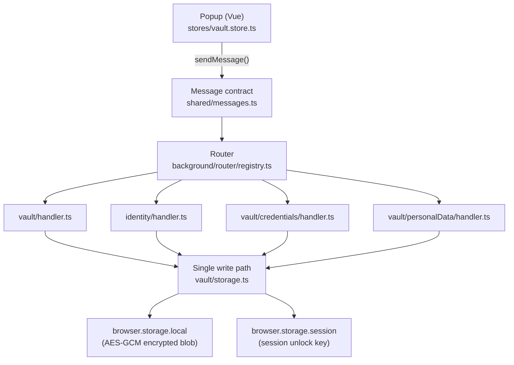
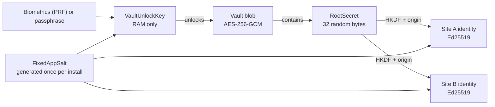
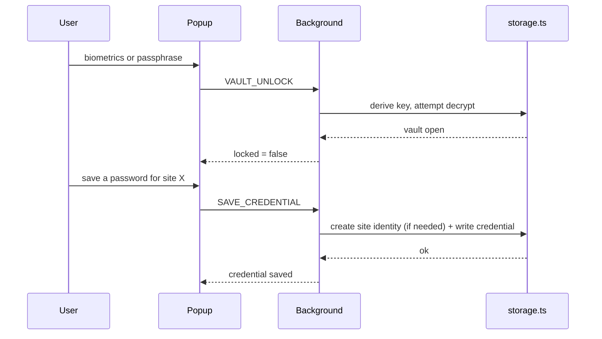

# Phase 2 recap: the local identity vault (plan → M6)

> Interactive version with the same diagrams: [Anatomia do Cofre](https://claude.ai/code/artifact/ddd1d23c-641a-4b0d-8864-7bf2f392c473) (Claude Artifact).
>
> Covers commits `eb6198a` through `d6f7ec7` -- the macro plan plus milestones M1-M6 of `docs/plans/phase-2-local-identity-vault.md`. M7-M9 (backup/export, biometric-gated disclosure, security-review gate) are still open; this recap does not claim the phase is finished.

This is the plain-language companion to `docs/adr/` and `docs/plans/phase-2-local-identity-vault.md` -- those stay the terse technical record; this file is the "what got built and why, explained simply" version, generated by the `/phase-recap` skill.

## The shape of it

The vault never leaves the user's machine: no server, no cloud, no account system. Every commit below is one step toward a working encrypted local store with one identity per site, built in dependency order -- each milestone needed the one before it.

*Fig. 1 -- every capability funnels through the one write path (`vault/storage.ts`), the structural fix for the "two out-of-sync vault copies" bug class found in Attestto's source (`docs/research/attestto-teardown.md`).*

## `eb6198a` -- Macro plan (M1-M9)

No functional code yet -- just the milestone-by-milestone plan (`docs/plans/phase-2-local-identity-vault.md`, 269 lines), grounded in the existing identity/data/security/threat-model docs. Resolved six open design questions (unlock method, `FixedAppSalt` lifecycle, backup KDF choice, pre-unlock UI, credentials/aliases scope, the Phase 3 gate) and found one real gap: ADR-010 as written wasn't literally implementable against the Web Crypto API (`generateKey()` has no seed parameter), fixed by committing to Ed25519 specifically.

## `49e96b4` -- M1: vault data schema & message contract

**Files:** `shared/vault-schema.ts` (new), `shared/messages.ts`, `background/router/{registry,dispatch}.ts`.

The Zod schema for the entire vault data tree (RootIdentity, PersonalData, Credentials, Aliases, ServiceIdentities, Policies, PrivacyLedger), plus the 13 vault/identity message types. Since handlers for these didn't exist yet, `registry.ts`'s type became `Partial` and `dispatch.ts` gained a `NOT_IMPLEMENTED` reply for any schema-valid-but-unregistered message -- letting the contract ship ahead of its implementation. 82 tests passing.

## `91c0351` -- M2: crypto primitives, key hierarchy, FixedAppSalt

**Files:** `background/vault/crypto.ts`, `background/vault/keys.ts`, `background/vault/salt.ts` (all new), `shared/bytes.ts` (new), `docs/adr/ADR-012`, `ADR-013`.

Pure Web Crypto primitives (HKDF-SHA256, AES-256-GCM, CSPRNG), verified against RFC 5869's own test vectors. The three-key hierarchy (ADR-013): **VaultUnlockKey** (ephemeral, RAM-only), **RootSecret** (32 random bytes, generated once), **BackupExportKey** (derived only at export time). `FixedAppSalt` is generated once per installation and never regenerated -- regenerating it would silently change every future derivation with no error. A real gap was caught here: Argon2id's cost parameters were going to be hardcoded, which would have silently stranded existing vaults if ever retuned; fixed by recording them per-vault. 116 tests passing.

## `524627f` -- M3: encrypted vault storage module

**Files:** `background/vault/storage.ts`, `background/vault/unlock.ts` (both new).

`storage.ts` becomes the only file allowed to touch the encrypted blob, serialized through a write queue. `unlock.ts` implements the unlock ceremony: derive the key, **verify it actually decrypts before caching it**, only then hold it for the session. A real empirical finding here: a `CryptoKey` object cannot survive a `browser.storage.session` round-trip (its properties are WebIDL prototype accessors, not own-enumerable data -- JSON serialization silently reduces it to `{}`). Fixed by caching only the raw derived bits and re-minting the `CryptoKey` on every read. 137 tests passing.

## `5191eed` -- M4: root identity setup, lock/unlock

**Files:** `background/vault/setup.ts`, `background/vault/handler.ts` (new), `stores/vault.store.ts` (new), `entrypoints/popup/App.vue`, `background/vault/storage.ts`.

First real UI: setup / locked / unlocked states in the popup. `vault.store.ts` is the only place `navigator.credentials` (WebAuthn/biometrics) is ever called, since that API needs a document context the background service worker doesn't have. Code review caught a real ordering bug: the configured unlock method and its matching credential were written as two sequential storage calls, so a service-worker restart mid-setup (a normal MV3 event, not a rare crash) could strand a vault with no repair path. Fixed with one atomic write. 167 tests passing; manually verified in Chrome (setup, lock, unlock, wrong-passphrase rejection).

## `298db0e` -- M5: Service Identity derivation (ADR-010, concretely)

**Files:** `background/identity/derive.ts`, `storage.ts`, `handler.ts` (all new), `docs/adr/ADR-014`.

`deriveServiceIdentityKeypair(rootSecret, origin)` -- the actual per-site identity: `RootSecret` + normalized site origin, through HKDF, into a deterministic Ed25519 keypair. Same root + same site always reproduces the same identity; same root + different site produces an unrelated one. The private key is never persisted, only its public key -- always re-derived on demand, which is what makes the whole vault recoverable from `RootSecret` alone. Resolved the Ed25519-vs-ECDSA question deferred since M2: verified empirically that Web Crypto's `importKey('pkcs8', ...)` accepts a bare 32-byte Ed25519 seed wrapped in a fixed RFC 8410 DER envelope, no extra library needed. 188 tests passing.

*Fig. 2 -- the same `RootSecret`, combined with each site's origin, always regenerates that site's identity -- no per-site backup needed.*

## `d6f7ec7` -- M6: credentials + personal data storage

**Files:** `background/vault/credentials/{storage,handler}.ts`, `background/vault/personalData/{storage,handler}.ts` (all new), `background/vault/storage.ts`.

The trees M1 only *shaped* get real read/write. Saving a credential for an origin with no Service Identity yet creates one in the same write, avoiding a half-finished record if the vault locks mid-operation. Personal data updates are patch-style, and an explicitly-`undefined` field in a patch is now stripped rather than overwriting a previously-saved value. A repeated "capture a result out of a vault write" pattern across three files was consolidated into one shared helper, `updateVaultDataWithResult`. 212 tests passing.

## End to end

*Fig. 3 -- every arrow is a typed message (Fig. 1); nothing touches disk outside the single write path in `storage.ts`.*

## Glossary

| Term | What it means here |
|---|---|
| `RootSecret` | 32 random bytes generated once -- the root every site identity is derived from. |
| `FixedAppSalt` | Random per-installation salt, generated once, never rotated. |
| `VaultUnlockKey` | The key that opens the vault; exists only in memory while unlocked. |
| HKDF | Standard construction for stretching a secret into a larger, deterministic key. |
| AES-256-GCM | The cipher locking the vault blob; also detects tampering. |
| Argon2id | Deliberately slow/expensive KDF used to turn a passphrase into a key. |
| Ed25519 | Signature algorithm used for site identities -- its private key is, by definition, a seed. |
| WebAuthn / PRF | Browser API that talks to biometrics without the extension ever seeing the biometric data itself. |
| MV3 service worker | The extension's background process -- can be restarted by the browser at any time, hence the atomic-write fixes above. |
