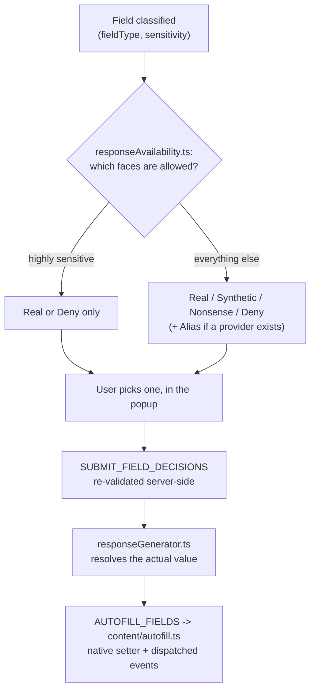

# Five Faces — Phase 3 Recap

**Interactive version:** https://claude.ai/code/artifact/e22e91da-fa97-47b3-8ef3-44afad46be36
**Commit range covered:** `c23511f`…`4ecce0a`

A site asks for an email. Identity Firewall now has to decide, field by field: is this really required, and if you hand something over — which of five faces does the site actually see? Phase 3 builds the desk where that decision gets made, and the hand that writes the answer back onto the page.

## The five faces on offer

Every recognized field resolves to exactly one of these — the vocabulary this whole phase is built around: **Real**, **Alias**, **Synthetic**, **Nonsense**, **Deny**.

## The docket

Seven commits, one continuous build: classify, decide what's allowed, let a person choose, write it back to the page — then two rounds of finding out, the hard way, what a real browser actually does.

0. **The case file** (`c23511f`) — six scope decisions, made explicit before any code.
1. **M1 — The classifier** (`903a56b`) — turning a raw `<input>` into a known field type, or leaving it alone.
2. **M2 — The pending request** (`a365f46`) — what a site is asking for, held ready for the popup to show.
3. **M3 — What's allowed** (`2508984`) — not every face fits every field.
4. **M4/M5 — The desk, and the hand** (`924026f`) — a person decides, then the page actually changes.
5. **Found by review** (`769fb00`) — a leak between tabs, a key collision, an error message stuck under the wrong form.
6. **M6 — Proof, on real sites** (`4ecce0a`) — a UK government page, Google, a real signup form.

## One field, five possible answers

The popup's own claim about what's "allowed" is checked twice — once to render the picker, once again when the decision actually arrives.

## The case file, before any code (`c23511f`)

Six scope decisions written down on purpose, so later milestones inherit a boundary instead of re-litigating it. Classification is deliberately narrow: only `PersonalDataSchema`'s six known fields ever get recognized. A comment box, a company name, a country dropdown — left entirely alone, not blocked, not asked about, since there's no vault data model for them and mis-blocking an ordinary field would break the site. Highly-sensitive fields (a national ID) only ever offer Real or Deny — never a fabricated value, because a fake CPF can break the user's own account, not just look bad.

**Alias, quietly deferred:** without a real email-alias provider configured, Alias falls back to Ask rather than generating a placeholder address that would silently bounce every message sent to it. Real provider integration is Phase 6's job.

And two trees stay untouched on purpose: nothing here writes to `Policies` or `PrivacyLedger` — both already schema-shaped since Phase 2, both confirmed still Phase 4's job to bring to life.

| Path | Purpose |
|---|---|
| `docs/plans/phase-3-identity-firewall.md` | Plan and scope for the six milestones |

## M1 — The classifier (`903a56b`)

Fills the `firewall` capability slot the router has reserved, empty, since Phase 1. `background/firewall/classifier.ts` reads a raw `DetectedField` and decides what it actually is, in three passes: the HTML `type` attribute first (an `email` input is unambiguous), then the WHATWG `autocomplete` token, then a name/id word-match as a last resort — checked in both English and Portuguese, since a CPF field on a real Brazilian form is exactly the case this classifier exists for.

`DetectedFieldSchema` gains one new raw attribute, `autocomplete` — still just an HTML attribute, not a judgment call, so it belongs in Phase 1's extraction layer rather than the classifier reading it. Sensitivity per field reuses `PERSONAL_DATA_FIELD_SENSITIVITY`, already sitting in the schema since Phase 2 for exactly this use.

| Path | Purpose |
|---|---|
| `background/firewall/classifier.ts` | Three-tier heuristic: type → autocomplete → name/id regex |
| `shared/messages.ts` | `DetectedFieldSchema` gains `autocomplete` |

## M2 — The pending request (`a365f46`)

Session state stops throwing away the interesting part. Until now, session state only remembered a form *count*. It now stores the classified forms themselves — `handleFormDetected` runs the classifier before persisting, so nothing downstream has to re-derive what a field actually is. A new `GET_PENDING_REQUEST` message, deliberately separate from the existing lightweight "sites visited" query, is what the approval UI reads from in M4.

`ClassifiedField`/`ClassifiedForm` moved into `shared/messages.ts` itself, so the message contract can reference the classifier's output shape without `shared/` reaching into `background/` or the reverse.

| Path | Purpose |
|---|---|
| `background/session/state.ts` | Stores classified forms, not just a count |
| `background/firewall/handler.ts` | `GET_PENDING_REQUEST` |

## M3 — What's allowed (`2508984`)

Not every face fits every field. `responseAvailability.ts` is the matrix: a national ID offers Real or Deny, full stop, never a fabricated value — the one rule this whole phase treats as non-negotiable. Every other recognized field offers Real, Synthetic, Nonsense, Deny. Alias stays off everywhere except email, and even there only once a real provider is configured.

`syntheticGenerator.ts` makes the fake values up: a synthetic email always ends in `.invalid`, the domain suffix reserved by RFC 2606 specifically so it can never accidentally route anywhere real. Both generators throw outright if ever asked for a national ID — not a graceful fallback, a loud failure, since that call should be structurally unreachable.

| Path | Purpose |
|---|---|
| `background/firewall/responseAvailability.ts` | The allowed-responses matrix per field |
| `background/firewall/syntheticGenerator.ts` | Fake values — synthetic email ends `.invalid` |
| `background/firewall/responseGenerator.ts` | Resolves a chosen face into an actual value |

## M4/M5 — The desk, and the hand (`924026f`)

A person decides. Then, for the first time, the extension actually writes back onto a page. The popup's "Pending request" section is the desk: sensitivity and required badges per field, a picker constrained to whatever M3's matrix actually allows, and per-form submission. `SUBMIT_FIELD_DECISIONS` re-validates every choice against the matrix server-side — the popup's own claim about what's allowed is never trusted on faith.

Writing the value back is its own small trap: `content/autofill.ts` sets each field through its element's *native* property setter, not a plain assignment, because a framework-controlled input (React, Vue) would otherwise silently revert a plain `.value = ...` the instant its own state re-renders. Real `input`/`change` events are dispatched afterward so the page's own listeners see it exactly as if it had been typed.

**Found only by actually running it:** `browser.tabs.query()` with no tab permission at all strips `url`/`title` from the result entirely — the popup had no way to know which site it was even open for. Fixed with the minimal `activeTab` permission, not the broader `tabs` — which only activates on a real toolbar click Playwright cannot simulate, making the full approve-and-fill loop a manual-verification item from here on, the same category of gap as Phase 2's real WebAuthn ceremony.

| Path | Purpose |
|---|---|
| `stores/firewall.store.ts` | Popup state: pending forms, decisions, submission |
| `content/autofill.ts` | Native-setter write-back + dispatched events |
| `wxt.config.ts` | Adds the minimal `activeTab` permission |

## Found by review, fixed before it shipped (`769fb00`)

Three real findings from one `/code-review` pass — the second one is the kind of bug that matters most in this project.

| Finding | Fix |
|---|---|
| A tab could navigate away while the popup stayed open; submitting would still resolve data for the *old* origin and hand it to whatever page the tab now shows — a real cross-site leak | Re-checks `browser.tabs.get(tabId)`'s current URL against the claimed origin before doing anything |
| Two fields sharing a `name` (billing/shipping "address") could collide onto one decision | The field key is now always index-prefixed |
| One shared `submitError` field meant a failure on form 0 rendered under every form's card | Renamed to `submitErrors`, keyed by form index |

## M6 — Proof, on real sites (`4ecce0a`)

The full loop, walked end to end, on the actual web — not a fixture. The classifier correctly recognized fields across three unrelated real sites: a UK government service, Google, and a real signup page. On that signup page, all four reachable faces — Real, Synthetic, Nonsense, Deny — were exercised end to end on its email field, with the live input actually receiving each resolved value in turn.

The Gate to Phase 4 checklist closed clean, including a grep confirming nothing in this phase's own code touches `Policies` or `PrivacyLedger` — the boundary the case file drew at the very start held all the way through.

## Terms worth knowing

- **Apparently required** — The HTML `required` attribute, passed through unmodified — a hint the UI treats as unverified, since no client-side signal can prove what a server actually enforces.
- **.invalid** — An RFC 2606 reserved top-level domain, guaranteed never to resolve — every synthetic email this phase generates ends here on purpose.
- **activeTab** — A Chrome permission granted only by a genuine user click on the extension's toolbar icon — deliberately narrower than the standing `tabs` permission, and unreachable by browser automation.
- **Native setter** — The property setter built into the DOM element itself, as opposed to whatever a JS framework has wrapped around it — the only way to change a value a framework won't silently undo.

---

*Compiled from real git history — commits `c23511f`…`4ecce0a` — Phase 3, complete.*
