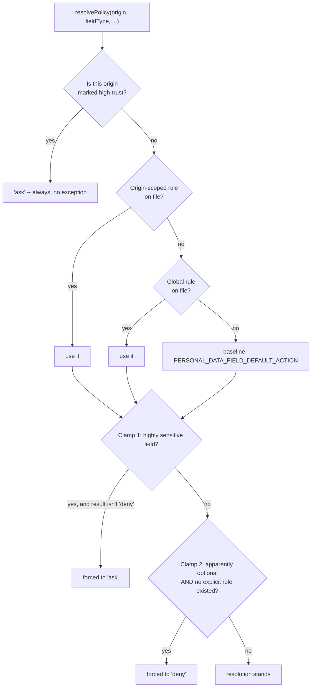
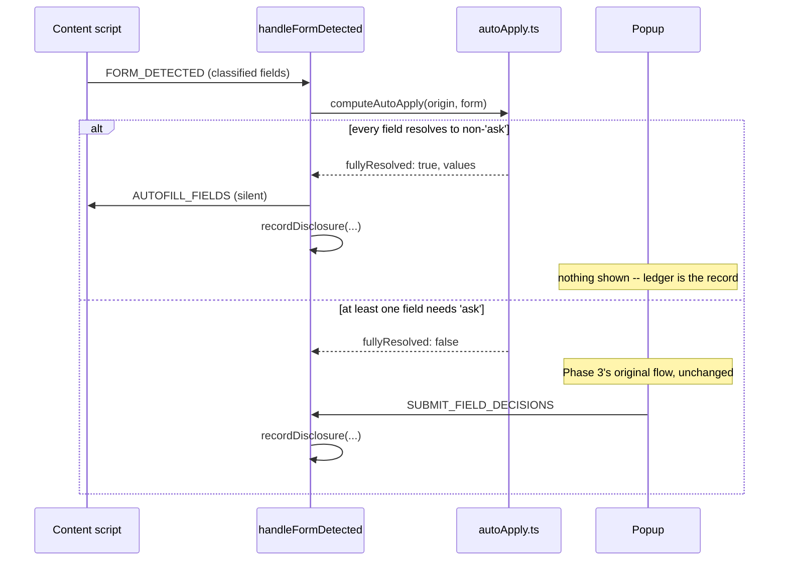

# The Register — Phase 4 Recap

**Interactive version:** https://claude.ai/code/artifact/19842b0a-01d7-4343-9c9e-cdcea7c6ec60
**Commit range covered:** `857f102`…`879199e`

Phase 3 could ask a person, field by field, forever. Phase 4 teaches Identity Firewall to remember what it decided last time — and to write down, permanently and locally, exactly what crossed the line and when. A standing rule replaces a repeated question; a ledger entry replaces trust on faith.

## The register

Nine commits: a schema that finally matches its own design doc, the resolution order that reads it, the silent path it unlocks, the view it makes possible, and two rounds of real-world proof.

0. **The plan** (`857f102`) — two schemas that existed since Phase 2 but nothing ever wrote to.
1. **M1 — The schema, corrected** (`704f075`) — rules keyed by field type, not sensitivity — and a fourth action: ask.
2. **M2 — Where rules live** (`5a241a2`) — one slot per (scope, field type), upserted, never duplicated.
3. **M3/M4 — The silent path** (`c0e23db`) — when every field is already decided, nothing pops up at all.
4. **A gap closed mid-stream** (`0599d7d`) — "optional" nearly fell through to the wrong default.
5. **M5 — What this site knows** (`2fa8fe3`) — every past disclosure, aggregated per origin.
6. **M6 — Safe mode** (`3f9ec7e`) — one checkbox that overrules every standing rule at once.
7. **Found by review** (`e86b9a3`) — eight finders, one root cause: a null returned too early.
8. **M7 — Proof, and two honest gaps** (`879199e`) — Phase 4 closes; two limitations get written down instead of hidden.

## How one field gets an answer

Safe mode beats everything. A national ID can never silently auto-disclose. An optional field nobody set a rule for stays blocked — unless someone deliberately set one.

## The plan: two schemas, never used (`857f102`)

Phase 2 shaped `PolicyRuleSchema` and `PrivacyLedgerEntrySchema` and then left them completely alone — confirmed by grep before touching either: zero other code referenced them, so both were free to reshape rather than migrate.

Two real gaps between what shipped and what `privacy-model.md` actually specifies got named before any code: a rule needs to be scoped by field type (and optionally origin), not sensitivity alone — phone and name carry equal sensitivity but different real-world defaults. And a policy action needs a fourth value beyond the five response types: `ask`, since a sensitive field is meant to keep prompting even under a "policy."

**Confirmed with the user before building:** once every recognized field on a form resolves to something other than `ask`, the Firewall acts with zero popup interaction. The ledger this same phase builds is the transparency mechanism for that silence, not a live prompt standing in its way.

| Path | Purpose |
|---|---|
| `docs/plans/phase-4-privacy-ledger-policy-engine.md` | Seven milestones, grounded in the existing unused schema |

## M1 — The schema, corrected (`704f075`)

Reshaping a schema nothing depends on yet is free; reshaping it later wouldn't be. `PolicyRule` is now scoped by field type and, optionally, by origin — a global "always deny phone" rule and a per-site override can coexist. `PolicyAction` (`ResponseType | 'ask'`) replaces a plain response type wherever a resolved decision is stored. `PrivacyLedgerEntry.disclosedFields` now records which response type was actually used per field — `privacy-model.md`'s own worked example, "Email → alias, Name → real," made literal — and gains `authorizationMethod`, always `null` until Phase 5's biometric gate exists to fill it in.

`background/policy/resolve.ts` is the resolution order in the diagram above. The highly-sensitive clamp exists specifically because Phase 5 hasn't shipped yet: nothing today should be able to auto-disclose a national ID with zero friction, since the "Ask + biometric" half of that protection is still missing.

| Path | Purpose |
|---|---|
| `shared/vault-schema.ts` | Reshaped `PolicyRule`/`PolicyAction`/`PrivacyLedgerEntry` |
| `background/policy/resolve.ts` | The four-source resolution order + two clamps |

## M2 — Where rules live (`5a241a2`)

One slot per (scope, field type) — never a growing pile of duplicates. `background/policy/storage.ts` reads and writes through the vault index tier that already exists — no new storage tier needed for this. `setPolicy` upserts by `(scope, fieldType)`, replacing whatever was already in that slot, since the resolution logic in M1 assumes at most one rule can ever occupy it. Origin comparisons are normalized throughout, so a rule set against one capitalization or port of an origin still matches a lookup against a differently-written version of the same one.

Four new messages — `GET_POLICIES`, `SET_POLICY`, `DELETE_POLICY`, `SET_HIGH_TRUST_ORIGIN` — land under a new `policy` router capability. Every handler returns the full current list rather than just the one item touched, so the popup never needs a second round trip just to see its own change reflected.

| Path | Purpose |
|---|---|
| `background/policy/storage.ts` | Upsert-by-slot reads/writes through the vault index |
| `background/policy/handler.ts` | The four policy messages |

## M3/M4 — The silent path (`c0e23db`)

The moment every recognized field already has an answer, the popup has nothing left to ask. `background/policy/autoApply.ts` is pure decision logic: given a classified form, does every recognized field resolve to something other than `ask`? When it does, `handleFormDetected` generates the values and relays `AUTOFILL_FIELDS` immediately — confirmed with the user as the intended design, not an accidental shortcut. The instant even one field needs `ask`, the whole form falls back exactly to Phase 3's original popup flow, unchanged.

If the vault happens to be locked at the moment a form is detected, automation is simply unavailable — every read `autoApply` needs throws `VaultLockedError`, caught and treated as "fall back to the popup," matching Phase 3's original behavior exactly rather than inventing a new locked-vault code path.

**The toolbar badge's meaning changed here:** it now counts only fields genuinely awaiting a decision, not every recognized field — a fully policy-covered form shows no badge at all, since there is nothing left for it to signal.

`background/policy/ledger.ts`'s `recordDisclosure` appends one entry for every disclosure this project can produce, wired into both this new automatic path and Phase 3's manual submission path. A field with no decision at all now counts as denied for the ledger's purposes — never silently omitted.

| Path | Purpose |
|---|---|
| `background/policy/autoApply.ts` | Pure logic: is this form fully resolved? |
| `background/policy/ledger.ts` | `recordDisclosure` — called from both paths |

## A gap closed mid-stream (`0599d7d`)

"Optional fields blocked by default" nearly lost to a blanket per-fieldType baseline. Without the field instance's own `apparentlyRequired` flag, an optional field with no explicit rule fell straight through to `PERSONAL_DATA_FIELD_DEFAULT_ACTION`'s generic baseline (e.g. name → `ask`) — silently ignoring a principle stated as non-negotiable since `privacy-model.md`. `resolvePolicy` now takes that flag directly; an explicit stored rule, global or origin-scoped, still overrides this fallback, since setting one is itself a conscious decision to auto-decide even an optional field.

The popup also gained real teeth here: `GET_PENDING_REQUEST` now returns `resolvedActions`, the exact same resolution the automatic path uses, and the store pre-fills a decision for every non-`ask` field the instant the list loads — replacing Phase 3's old placeholder heuristic, which only ever approximated what a real Policy Engine should decide. "Approve all" disappears from the popup entirely; there's nothing left to batch-approve once resolution has already run.

| Path | Purpose |
|---|---|
| `background/policy/resolve.ts` | Takes `apparentlyRequired` as an input |
| `stores/firewall.store.ts` | Pre-fills decisions from `resolvedActions` |

## M5 — "What does this site know about me?" (`2fa8fe3`)

Transparency stated as a principle only counts once there's a screen it shows up on. A new `GET_PRIVACY_LEDGER` message returns every entry recorded for one origin. The popup aggregates them into the per-service summary `privacy-model.md`'s own mockup describes: disclosed fields with their response type, denied fields, and a last-access time. The most recent entry touching a given field wins the aggregation — a person can change their mind about a field between visits, and the summary should reflect the current answer, not the first one.

| Path | Purpose |
|---|---|
| `background/policy/handler.ts` | `GET_PRIVACY_LEDGER` |
| `stores/privacyLedger.store.ts` | Per-origin aggregation, most-recent-wins |

## M6 — Safe mode (`3f9ec7e`)

The override existed since M1's resolution order. This is the switch a person can actually reach. A popup toggle marks or unmarks the active tab's origin as high-trust, alongside the warning banner `privacy-model.md`'s own mockup describes. Flipping it re-fetches `resolvedActions` immediately, so the effect — every field forced back to `ask`, regardless of any standing policy — is visible the instant it's set, on a government or banking site where a wrong auto-fill matters more than convenience.

| Path | Purpose |
|---|---|
| `stores/firewall.store.ts` | `toggleHighTrust` + safe-mode warning state |

## Found by review, one root cause (`e86b9a3`)

Eight independent finder angles from one `/code-review` pass, all converging on the same defect. `handleGetPendingRequest` returned `null` whenever no form had been detected yet for an origin this session — but safe mode is a persistent per-origin setting, not tied to session state at all. A person landing on a marked government site before any form loaded would see the checkbox unchecked and the banner hidden, with no way to even discover the real flag was still set.

**Fixed by always returning a full `PendingRequest`** (`forms: []` in place of `null`) — nothing downstream had ever actually distinguished the two cases.

The same pass caught three related bugs stemming from the same store method:

| Finding | Fix |
|---|---|
| Safe-mode state invisible with no forms detected yet | Always return a full `PendingRequest`, never `null` |
| Manual decisions wiped on every safe-mode toggle | Track auto-filled keys; refresh only those |
| Tab could navigate away mid-toggle | `SET_HIGH_TRUST_ORIGIN` now re-verifies the tab's origin |

## M7 — Proof, and two honest gaps (`879199e`)

Verified live: optional-defaults-to-deny on a real 8-field form, the availability matrix rejecting an unavailable response type, ledger entries matching exactly what was submitted, and safe mode correctly overriding automation with its banner shown.

Two limitations were found and written down rather than patched under pressure: a full-SPA signup page renders its form after the content script's one-shot detection pass already ran, so nothing there is ever seen — already named as Phase 6's own objective, not this phase's job. A multi-step signup wizard keeps more than one `<form>` in the DOM with only one step visible at a time; a fill likely lands in a hidden step's fields, indistinguishable from doing nothing without a visibility check the content script doesn't have.

**Chosen deliberately, not by default:** offered to the user as an explicit choice — document as a known limitation and move on, rather than reopen an already-closed milestone's scope to chase a fix.

The Gate to Phase 5 checklist closed clean; `CLAUDE.md`'s status line and plans index were updated to reflect Phases 1–4 complete.

## Silent, or a popup — decided per form

Both branches end at the same `recordDisclosure` call — nothing is ever disclosed, silently or by explicit choice, without a durable local entry.

## Terms worth knowing

- **PolicyAction** — A resolved decision for a field: one of the five response types, or `ask` — the fourth value this phase added specifically so a sensitive field can keep prompting even under a "policy."
- **High-trust origin** — A site a person has explicitly marked as government/financial — a user-maintained list for the MVP, not automatic domain or TLS detection, which would need an external data source this project doesn't have.
- **Fully resolved** — Every recognized field on a form has a non-`ask` policy action — the condition that triggers the silent path instead of the popup.
- **Privacy Ledger entry** — One permanent local record of one disclosure decision: which fields, which response type each got, when, from which origin.

---

*Compiled from real git history — commits `857f102`…`879199e` — Phase 4, complete.*
